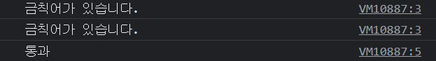
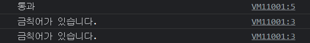

## 문자열 메소드

```javascript
// 금칙어 : 콜라

function hasCola(str) {
	if (str.indexOf("콜라")) {
		console.log("금칙어가 있습니다.");
	} else {
		console.log("통과");
	}
}

hasCola("와 사이다가 짱이야"); // -1  if(-1) -> true값이 반환됨
hasCola("무슨소리, 콜라가 최고");
hasCola("콜라"); // 0


```

```javascript
// 금칙어 : 콜라

function hasCola(str) {
	if (str.indexOf("콜라") > -1) {
		console.log("금칙어가 있습니다.");
	} else {
		console.log("통과");
	}
}

hasCola("와 사이다가 짱이야"); // -1
hasCola("무슨소리, 콜라가 최고");
hasCola("콜라"); // 0



```
